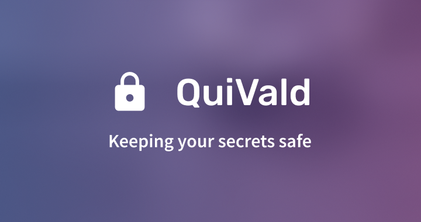

# QuiVald
In order to prevent security risks, it is advisable to not reuse the same
password too often. But remembering dozens of passwords, some probably seldom
used, is far too much trouble. With QuiVald, you can manage your passwords and
easily copy-paste them from the UI.

QuiVald is heavily inspired by [KeePass](https://keepass.info/).

## How to run
QuiVald is built using [JavaFX](https://openjfx.io/), a framework for creating
user interfaces. While JavaFX is included in all JDKs prior to JDK 11, JavaFX is
no longer bundled with all JDK versions starting from JDK 11. Long story short,
if you have JDK >= 11, you must download and install the JavaFX SDK to build
QuiVald.

The following dependencies are required to build QuiVald:
 - fasterxml.jackson.core
 - ``fasterxml.jackson.dataformat``
 - ``com.google.guava``
 - ``com.google.inject.guice``

Once you've installed all required dependencies, build a JAR from the source
code. Then, run the JAR like so:

```java
java -Dprism.lcdtext=false \
  --module-path "<path-to-javafx-lib>" \
  --add-modules javafx.base,javafx.controls,javafx.fxml \
  -jar "<path-to-jar>"
```
